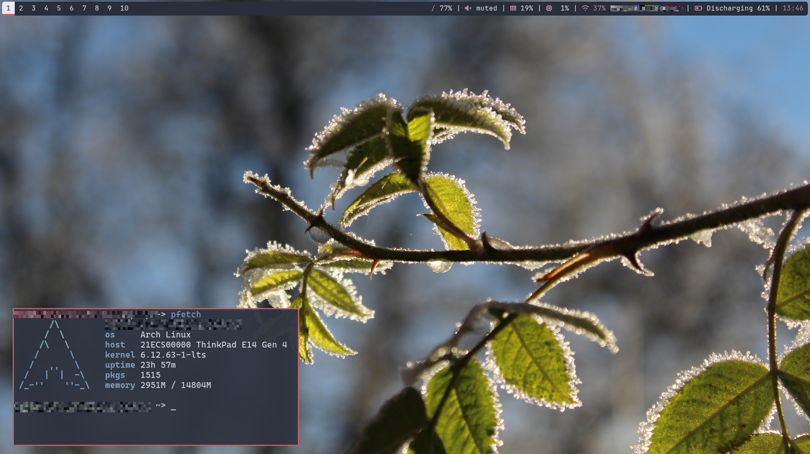

# 🖥️ 🐧 JDE – Jo's Desktop Environment

JDE is my minimalist desktop environment setup for **Arch Linux** based on **spectrwm** and **polybar** using **Nord** color scheme.
The goal is to create a lightweight, reproducible, and easy-to-maintain system that uses modular shell scripts and clear dotfile management via **GNU stow**. This collection of scripts was created to restore my personal desktop configuration on new computers and document my setup. Use at your own risk!


**This is work in progress**



---

## ✨ Features

- **Window Manager**: spectrwm – A minimal and efficient tiling window manager
- **Status Bar**: polybar – A highly customizable status bar
- **Dotfiles Management**: GNU stow for easy and transparent configuration management
- **Compositor**: picom for transparency and visual effects
- **Terminal**: alacritty as the default terminal emulator
- **Application Launcher**: rofi for fast application launching and menus
- **Notification daemon**: dunst
- **Color theme**: Nord color

---

## 📋 Requirements

- A minimal Arch Linux installation e.g with EndavourOS or archinstall
- Internet connection for package installation
- Basic familiarity with terminal usage

---

## ⚙️ Installation

### 1️⃣ Clone the repository

```bash
git clone https://github.com/johausmann/JDE.git
cd JDE
```

### 2️⃣ Run the main setup script

```bash
/setup.sh
```
This script will:

* 📦 Install all required packages (X-org, spectrwm, polybar, etc.)

* 🔗 Set up dotfiles using GNU stow

### 3️⃣ Start the desktop environment

```bash
startx
```
Or you can start the session wit a login manager such as **lemurs**

## 🛠️ Manual Installation

If you prefer to run the setup scripts individually:

```bash
# Install system packages
./setup/01-install-packages.sh

# Set up dotfiles
./setup/02-setup-paru.sh

```

## 🗂️ Directory Structure

```
JDE/
├── setup.sh                     # Main setup script
├── setup/
│   ├── 01-install-packages.sh   # Package installation
│   └── 02-setup-paru.sh     # Dotfiles setup using GNU stow
└── dotfiles/                    # Managed configuration files
    ├── spectrwm/                # spectrwm configuration
    ├── polybar/                 # polybar configuration
    └── X11/                     # Xorg / Xinit configuration
```

## 🎨 Customization

All configuration files live in the dotfiles/ directory and are managed using GNU stow.

To apply or update configurations manually:

```bash
cd dotfiles
stow -t ~ spectrwm
```

See dotfiles/README.md for details on managing and extending dotfiles.

## 📄 License

This project is licensed under the Apache License 2.0.
See the LICENSE file for more information.